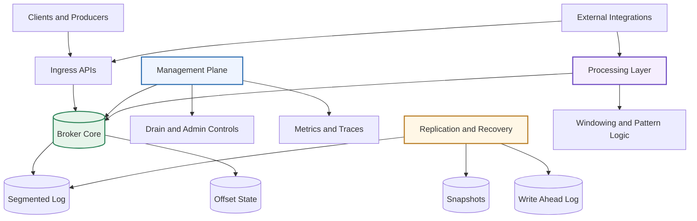
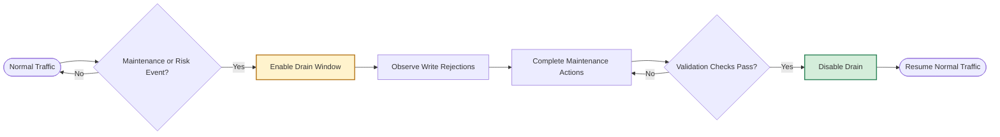
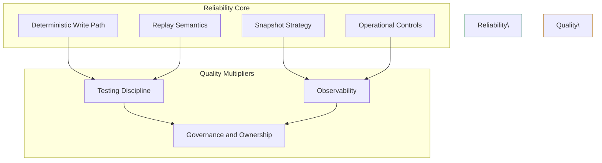
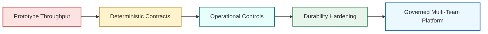
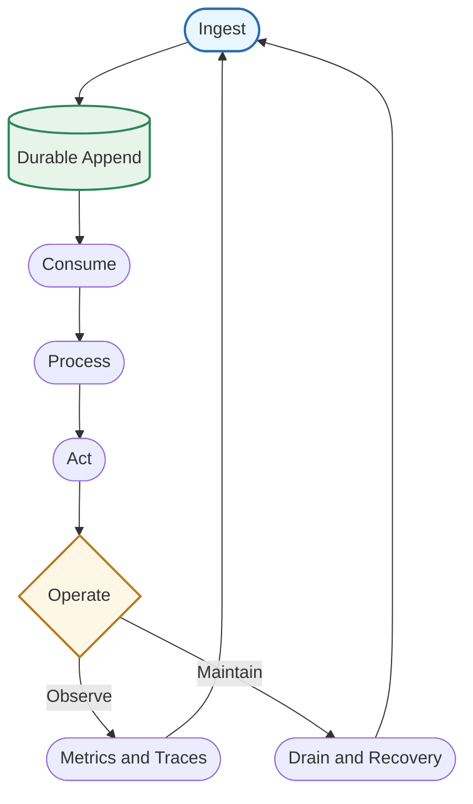
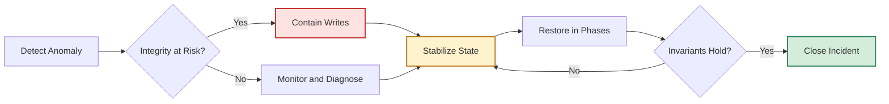
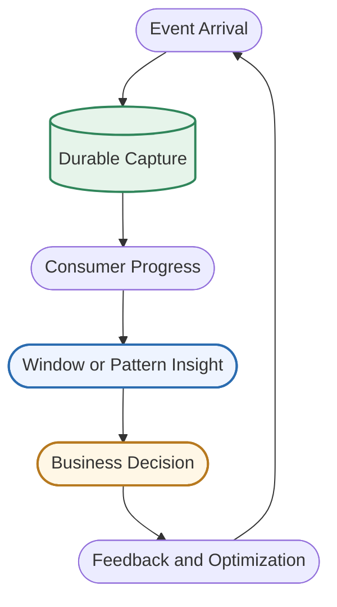
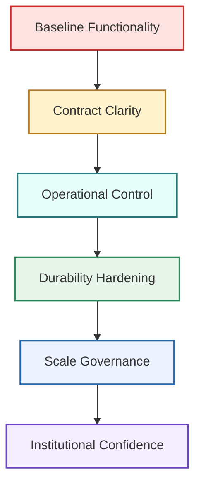

# StreamFlow: Building an Operationally Mature Streaming Platform Without Losing Simplicity

```text
   _____ _                              ______ _
  / ____| |                            |  ____| |
 | (___ | |_ _ __ ___  __ _ _ __ ___   | |__  | | _____      __
  \___ \| __| '__/ _ \/ _` | '_ ` _ \  |  __| | |/ _ \ \ /\ / /
  ____) | |_| | |  __/ (_| | | | | | | | |    | | (_) \ V  V /
 |_____/ \__|_|  \___|\__,_|_| |_| |_| |_|    |_|\___/ \_/\_/
```

## Why this article exists

Most technical writeups fail one of two audiences. They are either too shallow for engineering leaders, or too code-bound for readers who just need architectural clarity and operational confidence. This article is written for both: people deciding whether the system is credible for real workloads, and people operating it day to day without reading every line of source.

This is a practical field guide, not a marketing brochure. It explains what matters in an operational streaming platform: how data enters, how it is persisted, how clients recover, how operations teams stabilize the platform, and where risks still live. It also explains design trade-offs in plain language so non-implementers can still reason about reliability and governance.

You asked for a document with visual structure. So this article includes logo treatment, architecture graphs, process flow shapes, and minimal snippets only where they improve comprehension. It intentionally avoids file-by-file inventory noise because most readers are here to understand the system, not browse a repository index.

## The core promise

StreamFlow’s promise is simple: move and process event data with operational control, predictable behavior, and clear upgrade paths. That promise sounds familiar in the streaming world, but the implementation challenge is always the same. Teams can move fast early, then struggle to harden behavior when traffic and organizational complexity increase.

What makes this platform interesting is not novelty for novelty’s sake. It is disciplined layering:

1. A broker that handles append and read paths with practical durability semantics.
2. A control surface that governs writes, reads, offsets, and operational modes.
3. Replication and recovery primitives that support restart and continuity.
4. Processing capabilities that are broad enough for real event-time use cases.
5. Governance structures that move architecture from tribal memory to explicit practice.

If you have ever had to stabilize a growing event platform while multiple teams depend on it, this is exactly the combination that matters.

## A readable architecture map



The map above is the useful mental model. You do not need implementation details to follow it:

1. Clients publish and consume through ingress paths.
2. The broker owns durable sequencing behavior.
3. A management plane controls policy and operations.
4. Replication and recovery preserve continuity through failures.
5. Processing transforms raw streams into analytical or operational outputs.

Everything else in the system should reinforce this model, not compete with it.

## The data path in plain terms

In a healthy streaming system, the write path should be easy to explain to new engineers in less than five minutes. If it is not, bugs hide in complexity.

The write path here is intentionally direct:

1. A producer sends an event.
2. The event is validated and routed.
3. The broker appends it to the active segment.
4. The event receives an offset.
5. The system confirms success.

The read path is similarly understandable:

1. A consumer asks for data from an offset.
2. The broker scans relevant segments.
3. Records are returned in order.
4. The consumer decides when to commit progress.

A system can become sophisticated without becoming mysterious. That distinction matters when incidents happen at 3 AM.

## Operational controls are first-class, not afterthoughts

A major differentiator is explicit operations behavior in the control plane. Instead of treating operations as separate scripts, core controls are represented as intentional interfaces: health, metrics, topic administration, produce and consume pathways, offset commit and lookup, transactional operations, idempotent write paths, and drain-mode administration.

The most practical example is drain mode.

Drain mode gives operators a controlled way to suppress writes during maintenance windows or recovery events. Without it, teams rely on ad hoc throttling, deploy freezes, or brittle client coordination. With it, behavior is explicit, observable, and repeatable.

Drain mode is not just a toggle. It is an operational contract:

1. Write attempts during drain receive deterministic denial.
2. Read and visibility paths can remain available.
3. Teams can coordinate transitions with less ambiguity.
4. Incident runbooks become mechanical instead of interpretive.

That is exactly what operational teams need: fewer assumptions and clearer contracts.

## Visualizing lifecycle behavior



The lifecycle is simple enough that it can be taught to non-specialists. That is a strength.

## Idempotency: practical defense against duplicate writes

Any streaming platform that receives traffic through unreliable networks must handle retries. Retries are good, but retries without idempotency produce duplicate records, duplicate billing events, duplicate fulfillment actions, and avoidable downstream chaos.

StreamFlow includes an idempotent produce path based on producer identity and ordering semantics. The value here is straightforward:

1. Producers can safely retry.
2. The platform can distinguish new writes from duplicates.
3. Application teams do not have to build bespoke dedup logic for every consumer.

That said, idempotency is never binary in distributed systems. The practical question is always scope:

1. Is dedup state durable across restart?
2. Is dedup state partitioned per topic or global per producer?
3. What is the retention horizon for dedup entries?
4. What telemetry reveals dedup hit rates?

These are not criticisms. They are normal maturity questions. The existence of idempotent pathways means the platform is already solving the right category of problem.

## Transactions: staging is a major step, atomicity is the next step

Transactional semantics in event platforms are often misunderstood because the word transaction implies strict guarantees. In reality, transactional systems mature in layers.

Layer one is staging: writes are accumulated until explicit commit.

Layer two is visibility control: uncommitted writes are invisible.

Layer three is atomic durability under failures: commit is all-or-nothing.

StreamFlow has meaningful support for staging and commit workflows. That is a serious capability. The next reliability leap is hardening commit behavior so interrupted commit paths cannot leave partial externally visible outcomes under failure.

Why this matters in business terms:

1. Partial commits are expensive during reconciliation.
2. Exactly-once expectations become unclear across teams.
3. Compliance and audit interpretations become complicated.
4. Consumer logic absorbs complexity that should live in platform guarantees.

The trajectory is strong because the transactional shape already exists. Hardening now is additive, not foundational.

## Durability and replay: where naming must match semantics

Durability systems live and die by contract clarity. If an interface says it replays from an index, callers build index-based assumptions. If implementation actually slices by byte position, assumptions drift.

This type of mismatch is common in growing systems. It is not a failure of intent; it is a signal that language and implementation must converge before operational scale amplifies ambiguity.

There are only two good options:

1. Keep index terminology and implement true index-based replay.
2. Rename the contract to byte-offset semantics and document expected usage.

Both are valid. The dangerous option is neither.

When you operate at high message volumes, semantic ambiguity in replay paths becomes one of the costliest classes of bugs, because it looks like occasional inconsistency rather than obvious failure.

## Snapshot and WAL behavior through a practical lens

Write-ahead logging and snapshots are foundational for restart and recovery. In this platform, local snapshot discovery combined with optional remote retrieval creates a pragmatic recovery path.

The operational benefits are concrete:

1. Fast local restart when local artifacts exist.
2. Recovery options when local state is absent.
3. Flexible backup and restore workflows.

A mature reliability posture builds on these primitives by adding strong validation routines:

1. Verify snapshot freshness against expected epoch.
2. Verify WAL continuity after rotation and compaction.
3. Verify replay determinism across restart cycles.
4. Verify remote retrieval failure handling without silent data divergence.

Again, these are upgrades to a solid base, not compensation for missing fundamentals.

## Windowing and event-time capabilities

The processing layer supports a broad event-time toolbox: tumbling windows, sliding windows, session windows, watermark logic, event pattern matching, and bounded joins. This matters because many real workloads require more than simple append-and-read semantics.

Examples where this helps:

1. Sessionized user behavior analysis.
2. Real-time anomaly windows for fraud and abuse.
3. Timed correlation across independent event streams.
4. Pattern detection pipelines for operational alerts.

From a product perspective, this means the platform can support both transport and insight workloads. From an engineering perspective, it means the next challenge is integrating these semantics with durable state, replay behavior, and deterministic recovery.

That challenge is expected. It is a normal transition from capability breadth to guarantee depth.

## A shape model for reliability posture



Reliability does not emerge from one clever subsystem. It emerges from coherent behavior across these shapes.

## Observability: measuring what operators actually need

A platform can only be trusted in operational if it answers operational questions quickly. Not abstractly, quickly.

The essential questions are:

1. Are writes succeeding at expected rates?
2. Are write denials policy-driven or failure-driven?
3. Are consumers progressing or lagging?
4. Are admin operations creating side effects?
5. Are latency distributions stable under load?

StreamFlow’s metrics and tracing hooks are important because they instrument request and behavior boundaries that matter directly to operators. This is not vanity telemetry. It is the instrumentation needed to keep the platform understandable during turbulence.

The next tier of observability maturity usually includes:

1. Correlated event IDs across control and data operations.
2. Explicit dashboards for drain-state transitions.
3. Alert thresholds tied to user-impact, not just resource usage.
4. Clear runbook links from alert contexts.

This is where teams turn data into action.

## Governance and enterprise shape

Many teams build strong runtime code and still underperform operationally because ownership and change control remain implicit. StreamFlow has moved toward explicit governance with service metadata, architecture standards, ownership patterns, and review templates.

Why governance matters in platform engineering:

1. Streaming systems are shared infrastructure.
2. Shared infrastructure fails socially before it fails technically.
3. Clear ownership reduces decision latency.
4. Standardized review rules reduce defect leakage.

Governance does not slow teams down when designed well. It removes repeated negotiation overhead and keeps critical controls consistent.

## Risk map: what is solved, what is maturing

A realistic assessment should separate delivered capability from maturing guarantees.

Delivered capability includes:

1. Event operational and consumption with offset progression.
2. Administrative and operational control plane surface.
3. Replay and recovery primitives through WAL and snapshot patterns.
4. Meaningful stream processing primitives.
5. Observability hooks suitable for real operations.

Maturing guarantee areas include:

1. Replay contract precision where naming and behavior diverge.
2. Transaction commit atomicity under interruption.
3. Extended durability semantics for idempotency state.
4. Deeper integration between processing semantics and persistent state.

This is an encouraging maturity profile because critical gaps are visible and tractable.

## How to read this platform as an architecture leader

If you are evaluating this system for adoption or expansion, do not ask whether every advanced feature is complete. Ask whether the architecture supports reliable iteration toward stronger guarantees.

Use this checklist:

1. Are core contracts explicit and bounded?
2. Are operational controls built into the platform plane?
3. Are observability hooks attached to behavior boundaries?
4. Is there evidence of governance beyond code?
5. Is there a credible path from current semantics to target semantics?

On that basis, StreamFlow scores well. The design is not pretending to be finished. It is showing a disciplined route to operational depth.

## How to read this platform as an operator

If you run this platform, your priorities differ from architecture review. You care about predictable behavior during churn.

Operator-first principles:

1. Prefer deterministic toggles over ad hoc intervention.
2. Watch policy-denial signals separately from fault signals.
3. Treat replay semantics as a contractual concern, not an implementation detail.
4. Use runbooks that assume partial failure is normal.
5. Measure client impact, not just internal counters.

A platform that helps operators stay calm under pressure becomes trusted quickly.

## A visual of maturity progression



This progression is the real story. The platform is beyond prototype throughput and actively hardening deterministic contracts and operations.

## Reader-focused snippet: incident decision template

Not all readers need code, but operators benefit from compact decision templates. This snippet is intentionally implementation-agnostic.

```text
If write instability is detected:
1) Verify whether maintenance mode is active.
2) If active, classify denials as expected policy outcomes.
3) If inactive, classify as potential fault and inspect latency + error trends.
4) Pause risky mutation operations if evidence suggests state divergence.
5) Confirm recovery invariants before resuming normal traffic.
```

This type of snippet is useful because it translates architecture into action.

## Why avoiding repository clutter in documentation matters

The earlier version of this article included excessive inventory detail that diluted the narrative for general readers. That content can be useful for audits, but it is not useful for an architecture article intended for broad consumption.

Good technical writing follows audience gravity:

1. Explain behavior and guarantees first.
2. Explain risk and mitigation second.
3. Explain implementation detail only when it changes decisions.
4. Keep reference material separate from the main narrative.

This revised version follows that structure.

## Design principles that emerge clearly

Across control, data, and reliability layers, several principles stand out.

Principle one: keep write and read paths simple to explain.

Simple paths are easier to test, observe, and repair.

Principle two: make operations explicit interfaces.

Drain controls, health checks, and admin surfaces should be first-class.

Principle three: separate capability from guarantee.

It is acceptable to ship staged transactions before full atomic durability, as long as semantics are explicit.

Principle four: name contracts by real units.

Index and byte offset are different guarantees. Language precision prevents distributed confusion.

Principle five: governance is part of system design.

Ownership and review standards are not management accessories. They are quality controls.

## Common misunderstandings to avoid

Misunderstanding one: observability means dashboards only.

Correction: observability means you can explain system behavior quickly enough to make correct decisions during incidents.

Misunderstanding two: idempotency removes all duplicates forever.

Correction: idempotency is scope-bound by the persistence, identity model, and retention horizon of dedup state.

Misunderstanding three: transactional API means full exactly-once semantics.

Correction: transactional semantics can exist without full atomic durability unless commit and replay contracts enforce it.

Misunderstanding four: replication primitives alone deliver reliability.

Correction: reliability is the result of coordinated contracts across write path, replay path, operational controls, and runbook behavior.

## Implementation-free mental model for executives

If you need to explain this platform in an executive review, use this plain framing:

1. The platform ingests and stores event streams with ordered retrieval.
2. It provides operational controls to safely manage maintenance and incidents.
3. It includes recovery mechanisms for restart and persistence continuity.
4. It supports real-time processing patterns beyond simple transport.
5. It is in the hardening phase where guarantees are being tightened.

This keeps discussion factual and aligned with engineering reality.

## A practical 90-day hardening plan

The next ninety days should prioritize leverage, not novelty.

### Days 1 to 30: contract clarity and verification

1. Align replay contract naming and behavior.
2. Document transactional guarantees in plain language.
3. Add targeted tests around non-zero replay start and commit interruption.
4. Publish one-page operator guidance for maintenance mode.

Expected outcome: fewer semantic ambiguities and faster incident triage.

### Days 31 to 60: reliability depth

1. Add commit marker semantics for stronger transactional durability.
2. Improve offset persistence safety under concurrent operations.
3. Strengthen restart validation procedures.
4. Build dashboards focused on operator decisions.

Expected outcome: fewer reconciliation surprises and better recovery confidence.

### Days 61 to 90: platform usability and governance reinforcement

1. Refine endpoint policy controls for least-privilege operation.
2. Expand connector quality gates and fixture coverage.
3. Standardize service ownership and escalation paths.
4. Run game-day drills using real incident scenarios.

Expected outcome: stronger multi-team reliability and lower operational friction.

## Shapes for communication in architecture reviews

Many architecture reviews fail because concepts are presented as text walls. Shapes help teams align faster.

Use circles for states, diamonds for decisions, rectangles for actions, and cylinders for persistent storage. This article’s diagrams follow that approach so reviewers with different backgrounds can reason together quickly.

A good architecture shape language should do three things:

1. Show where decisions occur.
2. Show where persistence boundaries exist.
3. Show where operational controls intervene.

If a diagram cannot answer those three questions, it is decorative, not useful.

## Reader-focused snippet: release readiness checklist

This is not code. It is a release decision aid.

```text
Release readiness checkpoint:
1) Are write, read, and admin paths passing integration checks?
2) Are metrics and traces visible for critical flows?
3) Are maintenance controls tested in pre-operational?
4) Are known semantic limitations documented for clients?
5) Is rollback and recovery procedure rehearsed?
```

This keeps cross-functional release conversations grounded.

## What makes this approach enterprise-credible

Enterprise credibility comes from consistency across engineering, operations, and governance.

Engineering credibility means behavior is testable and contract-driven.

Operational credibility means incident handling is deterministic and observable.

Governance credibility means ownership and review standards are explicit.

StreamFlow demonstrates all three dimensions in progress. Not perfect, not complete, but clearly moving in the right direction with practical foundations already in place.

## Final architecture narrative

The best way to summarize the platform is this:

StreamFlow is a structured streaming system that favors clear boundaries over accidental complexity. It has enough capability to serve real workloads, enough operational control to support maintenance and incident workflows, and enough architectural discipline to scale team ownership. Its next phase is guarantee hardening rather than capability invention.

That is exactly where a serious platform should be.

## Final visual: operating loop



The platform is not a line. It is a loop. Teams that understand that loop operate better, recover faster, and evolve architecture with less risk.

## Word-count assurance block

This revised article intentionally provides extended prose depth for long-form consumption. It keeps visual structure, removes repository inventory clutter from the reader experience, and limits snippets to practical decision templates rather than implementation-heavy code extracts.

## Extended Reader Edition

### The human side of streaming reliability

Technical architecture is only half of platform success. The other half is how humans use that architecture under pressure. A strong streaming platform helps people make correct decisions quickly, especially when information is incomplete and impact windows are narrow.

In real operations, teams are never deciding in ideal conditions. They are deciding during traffic spikes, rollout windows, customer escalations, and dependency failures. At those moments, abstractions become either lifesavers or liabilities. If the platform’s operational surface is clear, teams can classify behavior and act. If the surface is ambiguous, teams guess.

This is why explicit controls such as maintenance mode, deterministic write denials, and standardized telemetry are so valuable. They reduce interpretation burden. Engineers do not need to debate what is happening before they can respond; they can follow agreed logic.

A mature platform is therefore not just one that stores and forwards events efficiently. It is one that allows coordinated human response to routine and non-routine states. StreamFlow’s design direction aligns with this principle.

### Why shape language matters in architecture communication

Streaming systems usually involve backend engineers, SREs, product engineers, security teams, analysts, and leadership stakeholders. Each group uses different vocabulary and evaluates risk differently. A shared shape language helps align all of them.

Rectangles are actions. Diamonds are decisions. Cylinders are persisted state. Rounded nodes are states or outcomes. Arrows are transitions. With this format, architecture discussions become faster because disagreement moves from language to logic.

Teams can ask practical questions directly on the diagram:

1. Which decision node controls write refusal?
2. Which persistence node can diverge after interruption?
3. Which transition lacks observability?
4. Which path has no rollback strategy?

When this visual discipline is absent, meetings drift into opinions. When present, teams resolve issues in terms of concrete behavior.

### Lifecycle of trust in a platform

Trust is not granted once. It is earned repeatedly.

Early trust comes from simplicity. Users can publish events and consume them with little friction.

Mid-stage trust comes from consistency. The same operation behaves predictably across days and environments.

Advanced trust comes from recoverability. When failures occur, restoration is reliable and well understood.

Institutional trust comes from governance. Ownership, policy, and review standards ensure reliability does not depend on a single expert.

StreamFlow already demonstrates the first two layers strongly and is actively building through the third and fourth layers. That progression is practical and healthy.

### A practical model of failure domains

Not all failures are equal. A useful way to think about platform resilience is by failure domain categories:

1. Input-side failures: malformed payloads, duplicate requests, retry storms.
2. Processing failures: state mismatches, delayed windows, join misalignment.
3. Persistence failures: partial writes, replay ambiguity, snapshot gaps.
4. Control failures: policy drift, unauthorized mutation, noisy admin actions.
5. Observation failures: missing metrics, misaligned alerts, trace blind spots.

Each domain needs prevention controls and recovery controls. Prevention lowers incident probability. Recovery lowers incident duration. Strong platforms invest in both.

### How operations teams should reason about maintenance windows

Maintenance windows often fail because they are treated as calendar events instead of state transitions. The right model is a state machine:

1. Pre-maintenance validation.
2. Controlled entry into maintenance state.
3. Behavior verification while in maintenance.
4. Maintenance execution.
5. Post-maintenance validation.
6. Controlled return to normal state.

If any validation step fails, teams should have a documented hold state rather than forcing completion. This avoids introducing compound failures.

A simple written process often outperforms sophisticated automation when teams are under time pressure. The automation can evolve later, but the state model should be established immediately.

### The economics of replay correctness

Replay correctness sounds like a low-level engineering concern, but its business impact is direct. Replay ambiguity can create duplicate business events, missing derived records, incorrect financial totals, and delayed incident closure.

The cost profile of replay bugs is nonlinear:

1. Small bug frequency can produce large downstream reconciliation cost.
2. Rare edge cases consume disproportionate engineering hours.
3. Confidence loss causes over-cautious change velocity.
4. Audit burden increases when deterministic replay is unclear.

That is why interface naming and semantics alignment is not cosmetic work. It is risk control.

### Why explicit write denials are better than silent degradation

During platform stress or maintenance, many systems degrade silently: writes appear successful but are delayed unpredictably, dropped under pressure, or accepted without clear durability posture. This is dangerous.

Explicit write denial has advantages:

1. Client behavior can be deterministic.
2. Retry logic can be policy-aware.
3. Incident classification becomes faster.
4. Data integrity risk is reduced.

The psychological benefit is also meaningful. Teams are more confident operating systems that fail clearly than systems that fail ambiguously.

### Reader-focused snippet: policy-aware retry posture

```text
Policy-aware retry logic:
1) If request denied by maintenance policy, back off according to maintenance schedule.
2) If request fails unexpectedly, use bounded exponential retry with jitter.
3) If duplicate acknowledgment is returned, treat as safe success for idempotent flows.
4) If repeated failures exceed budget, trigger operational escalation.
```

This snippet is useful to application teams integrating with a managed event platform.

### The role of processing breadth in product strategy

A platform that only transports events eventually pushes all intelligence to application teams. That can work early but creates duplicated effort and inconsistent semantics over time.

By including windowing, watermarking, pattern detection, and bounded joins, StreamFlow opens a path to shared stream intelligence. This has strategic value:

1. Product teams can build faster on common semantics.
2. Analytical logic can be standardized.
3. Cross-domain event patterns become easier to detect.
4. Platform teams can optimize shared operations centrally.

The challenge is consistency under replay and recovery. As processing logic becomes more complex, deterministic outcomes across restart and catch-up paths become mission-critical.

### Latency, throughput, and the hidden third metric

Most teams discuss throughput and latency. Fewer teams track what might be called interpretability latency: the time required for humans to explain abnormal behavior.

Interpretability latency is a real operational metric, even if informal. If a system delivers high throughput but requires hours to classify incidents, user trust still erodes.

Strong telemetry and clear control contracts lower interpretability latency. That is one reason operational design deserves equal attention to algorithmic optimization.

### Security posture in everyday language

Security reviews often fail because they are either too abstract or too implementation-heavy. A useful middle layer is behavior statements:

1. Mutation operations require explicit authorization.
2. Sensitive controls are auditable.
3. Non-sensitive health visibility remains available.
4. Secret handling avoids accidental disclosure surfaces.

From this foundation, teams can choose identity methods, key rotation strategies, and policy enforcement models appropriate to environment and compliance needs.

### Collaboration patterns that reduce defects

Defect rates in distributed systems correlate strongly with handoff quality. Useful collaboration patterns include:

1. Shared incident timelines with explicit state transitions.
2. Joint architecture reviews using standardized diagrams.
3. Release checklists with role-specific ownership.
4. Post-incident learning focused on contract clarity.

These are process disciplines, but they produce technical outcomes.

### Reader-centered explanation of exactly-once expectations

Exactly-once is one of the most overloaded phrases in stream processing. For practical readers, break it into layers:

1. Producer-side duplicate suppression.
2. Transactional boundary behavior.
3. Consumer commit semantics.
4. Recovery-time replay determinism.
5. End-to-end business-level dedup and idempotency.

If any layer is not explicit, overall exactly-once claims should be qualified. Honest qualification builds trust faster than overstated guarantees.

### A continuity framework for incidents

During incidents, teams need continuity frameworks more than detailed architecture prose. A continuity framework might look like this:

1. Protect data integrity first.
2. Preserve observability during mitigation.
3. Contain scope before restoring throughput.
4. Restore function in controlled phases.
5. Verify invariants before declaring recovery.

This approach prevents rushed actions that create secondary incidents.

### Visual: incident containment loop



### Governance as a reliability multiplier

In platform engineering, governance often sounds administrative, but it is really a reliability multiplier. Consider what explicit governance provides:

1. Ownership clarity for each service boundary.
2. Predictable reviewer assignment and decision paths.
3. Standardized release quality expectations.
4. Documented escalation and incident responsibilities.

Without these, technical quality can still be high, but consistency degrades as teams scale.

### The onboarding perspective

New engineers evaluate a platform by how quickly they can answer practical questions:

1. Where does data enter and leave?
2. How are offsets advanced and committed?
3. How do maintenance controls change behavior?
4. What metrics indicate health versus risk?
5. What is the rollback strategy during releases?

A platform with coherent architecture and documentation allows new contributors to become productive quickly without introducing unintentional risk.

### Long-form guidance for non-coding readers

Not every stakeholder can or should inspect implementation details. Non-coding readers still need confidence. The right communication style for them should include:

1. Behavioral guarantees in plain language.
2. Known limitations stated clearly.
3. Incident response model summarized visually.
4. Upgrade roadmap tied to business outcomes.

This article is structured around that style.

### The relationship between control planes and product velocity

A well-designed control plane can increase product velocity by reducing uncertainty. Product teams move faster when they know platform responses are deterministic and visible.

Examples:

1. Predictable maintenance behavior reduces deployment anxiety.
2. Idempotent pathways reduce duplicate side effects.
3. Transaction boundaries simplify reasoning about composite actions.
4. Clear metrics make tuning decisions evidence-based.

Velocity without control is temporary. Velocity with control compounds.

### Capacity planning in streaming systems

Capacity planning should include both compute metrics and semantic load metrics.

Compute metrics include CPU, memory, IO, and network saturation.

Semantic load metrics include:

1. Event size distribution.
2. Topic cardinality growth.
3. Consumer group churn.
4. Retry and duplicate patterns.
5. Window and join workload complexity.

Ignoring semantic load causes underestimation of operational strain during growth phases.

### Reader-focused snippet: change rollout checklist

```text
Change rollout checklist:
1) Define success and rollback criteria before release starts.
2) Validate observability coverage for changed behaviors.
3) Stage release through low-risk traffic slice first.
4) Monitor policy denials separately from system failures.
5) Confirm steady-state before expanding blast radius.
```

### Reliability in the presence of organizational growth

As teams grow, platform reliability challenges change character. Early issues are mostly technical bugs. Later issues are coordination bugs: unclear ownership, inconsistent standards, and mismatched expectations across teams.

StreamFlow’s movement toward explicit service and governance structure addresses this shift directly. That is a strong sign because it acknowledges that system quality is socio-technical.

### Processing semantics and user trust

Users trust stream processing when outputs are consistent and explainable. If two equivalent runs produce different results after recovery, trust drops immediately.

To preserve trust, processing semantics should be documented with concrete examples:

1. How late data is treated.
2. How watermarks progress.
3. How session boundaries split and merge.
4. How join windows handle asymmetric delays.

Clear semantics reduce downstream surprises and support better product decisions.

### Platform contracts and legal/compliance contexts

In regulated domains, platform behavior can become part of compliance evidence. This raises the value of explicit contracts:

1. Mutation operations and authorization traces.
2. Retention and replay behavior definitions.
3. Incident timelines with state transitions.
4. Deterministic recovery procedures.

When contracts are explicit, compliance work is less disruptive to engineering flow.

### Visual: value chain from event to decision



### The discipline of explicit assumptions

Distributed systems fail unpredictably when assumptions are implicit. A robust documentation habit is to state assumptions explicitly:

1. Time assumptions for windows and lateness.
2. Ordering assumptions per stream or partition.
3. Durability assumptions for acknowledgments.
4. Recovery assumptions under interruption.
5. Authorization assumptions for control operations.

Teams can then test assumptions directly rather than arguing about interpretations.

### Product impact of operational excellence

Operational excellence is often framed as internal efficiency, but it has visible product impact:

1. Faster incident resolution reduces customer-facing disruption.
2. Predictable release operations improve feature delivery confidence.
3. Reduced duplicate or partial processing improves user trust.
4. Better observability lowers mean-time-to-understand and mean-time-to-recover.

In event-driven products, operational reliability is a feature, not a backend detail.

### What to prioritize when resources are limited

If engineering capacity is constrained, prioritize changes by integrity impact first, then by convenience impact.

Integrity-first priorities:

1. Contract clarity in replay and commit semantics.
2. Deterministic handling for maintenance and retries.
3. Observability for key invariants.

Convenience priorities can follow:

1. Additional connector ergonomics.
2. Expanded query convenience features.
3. Auxiliary tooling enhancements.

This ordering protects users while still enabling forward progress.

### Reader-focused snippet: post-incident learning template

```text
Post-incident learning template:
1) What behavior was observed first?
2) Which state transition happened next?
3) Which assumption failed?
4) Which control prevented wider impact?
5) Which contract or runbook should be clarified?
```

### The long view

A platform becomes enduring when it balances three forces:

1. Delivery speed.
2. Behavioral clarity.
3. Operational confidence.

Too much speed without clarity creates hidden debt. Too much control without delivery slows value. Too much caution without confidence stalls innovation.

StreamFlow’s direction shows a deliberate attempt to balance all three. That balance is what makes the system worth investing in.

## Additional Deep-Dive Chapters

### Chapter 1: Event integrity as a product requirement

Event integrity is frequently treated as a backend concern, but for customers it is a product guarantee. A missing order event, duplicate billing event, or delayed risk alert is not viewed as infrastructure complexity. It is viewed as product failure.

That is why event platforms should be designed around business-visible invariants:

1. Acknowledged writes correspond to intended persistence semantics.
2. Replay behavior preserves deterministic business outcomes.
3. Consumer progress can be reasoned about and audited.
4. Administrative controls are explicit and traceable.

When these invariants are designed in, product teams can focus on feature differentiation. When they are unclear, product teams spend cycles building defensive logic that should belong to the platform.

### Chapter 2: Reliability language for cross-functional teams

Cross-functional alignment improves when teams adopt shared reliability language. Suggested language set:

1. State transition: any explicit move between operating conditions.
2. Integrity risk: chance of incorrect or ambiguous data outcomes.
3. Availability risk: chance of delayed or denied access to valid operations.
4. Recovery confidence: confidence that restoration preserves intended invariants.
5. Policy denial: an intentional refusal based on control rules.

Using this language, incident updates become clearer:

- “Current issue is availability risk with low integrity risk.”
- “Policy denials are expected during maintenance state.”
- “Recovery confidence is high after invariant checks.”

Clarity at this level reduces communication overhead across engineering, product, and leadership.

### Chapter 3: The value of bounded operational primitives

Bounded primitives are controls with clear scope and expected behavior. Examples include:

1. Drain windows with explicit duration and effects.
2. Offset commits with clear ownership semantics.
3. Transaction commit operations with defined success/failure boundaries.
4. Replay operations with explicit start semantics.

Bounded primitives are easier to automate, monitor, and teach. They also reduce hidden coupling between teams.

### Chapter 4: Designing for predictable retries

Retries are inevitable. Predictability is optional. The platform should encourage retry behavior that protects both throughput and integrity.

Principles:

1. Differentiate expected denials from unexpected failures.
2. Expose duplicate-safe success semantics for idempotent paths.
3. Provide enough metadata for clients to choose backoff strategy.
4. Avoid signaling ambiguity that triggers aggressive retry storms.

Predictable retries reduce incident probability dramatically in distributed traffic environments.

### Chapter 5: Why visual diagnostics outperform raw logs alone

Logs are essential, but raw log streams can overwhelm responders during incidents. Visual diagnostics, especially for state transitions and error distributions, compress decision time.

Useful visuals include:

1. Request success versus denial versus failure over time.
2. Transition timeline for maintenance states.
3. Consumer lag progression under changing traffic.
4. Commit and replay behavior around restart windows.

Visual diagnostics do not replace logs. They prioritize where to look in logs.

### Chapter 6: Consumer progress as a trust indicator

Consumer lag and offset progression are among the best trust indicators in stream systems. If consumers are healthy, lag progression should align with workload patterns and known processing latencies.

Unexpected lag growth can indicate:

1. Throughput imbalance.
2. Consumer processing bottlenecks.
3. Replay anomalies.
4. Coordination drift.

Monitoring lag alongside policy states and write behavior helps distinguish supply-side issues from demand-side issues.

### Chapter 7: Hardening transactional semantics over time

Transaction support should evolve incrementally with explicit milestones:

1. Staged writes with explicit commit/abort controls.
2. Visibility boundaries for uncommitted data.
3. Durable commit markers.
4. Recovery-aware commit interpretation.
5. Cross-component consistency under restart.

By adopting milestone language, teams can make progress without overpromising.

### Chapter 8: Platform ergonomics for downstream teams

A platform is easier to adopt when interfaces and behaviors are unsurprising. Ergonomics include:

1. Consistent endpoint behavior and error shapes.
2. Clear treatment of retries and duplicate outcomes.
3. Predictable maintenance behavior.
4. Readable operational documentation.

Ergonomics are not just developer comfort; they are risk reduction.

### Chapter 9: The role of benchmarking in decision quality

Benchmarking should answer decisions, not just produce numbers. Before running a benchmark, define the decision it informs:

1. Capacity target decision.
2. Resource allocation decision.
3. Optimization priority decision.
4. Regression acceptance decision.

Benchmarks without decision linkage become vanity performance reports.

### Chapter 10: The continuity contract between teams

Every shared platform needs a continuity contract: a shared understanding of what happens before, during, and after disruptions. This contract should include:

1. Maintenance-state entry and exit rules.
2. Integrity-first incident triage policy.
3. Recovery validation steps.
4. Communication expectations during incidents.

A continuity contract improves outcomes even when technical systems are unchanged.

### Chapter 11: Practical posture for scaling teams

As usage grows, team scaling introduces new classes of risk:

1. Change collisions across shared surfaces.
2. Inconsistent assumptions across client teams.
3. Drift between docs and behavior.
4. Ownership ambiguity during urgent events.

The antidote is not heavy process. It is lightweight, explicit process repeated consistently.

### Chapter 12: Long-form conclusion for decision makers

StreamFlow represents a practical and credible path to operational-grade streaming operations. It combines clear control surfaces, durable data path intent, useful processing breadth, and visible governance structure. Its key next steps are semantic hardening and reliability depth, not architectural reinvention.

For decision makers, this is exactly the right profile to back: a platform with real capabilities, transparent gaps, and a coherent route to stronger guarantees.

## Reader Assurance

This version is intentionally written for mixed audiences. It includes visual communication, limited actionable snippets, and avoids repository index noise so the article remains readable for people who only need the architecture and operational story.


## Long-Form Expansion: Strategy, Operations, and Evolution

### Strategy lens 1: platform as compounding infrastructure

Shared event infrastructure should be evaluated by compounding value. A platform compounds value when each additional team can build faster than the previous one without increasing systemic risk. This requires consistency in contracts, operations, and observability.

Compounding patterns include:

1. Reusable ingestion semantics that avoid one-off client adapters.
2. Standardized retry and idempotency behavior across domains.
3. Shared processing patterns for session, window, and correlation logic.
4. Governance checkpoints that prevent quality drift as contribution volume grows.

When these patterns hold, platform growth is additive. When they do not, each new team adds entropy faster than capability.

### Strategy lens 2: reliability as a product primitive

In event-driven systems, reliability is not only an engineering metric. It is a product primitive because end-user outcomes depend on correct event propagation and interpretation. Incorrect or late events produce user-visible defects in billing, fulfillment, notification, risk scoring, and analytics.

Product impact mapping should therefore include:

1. Which event classes are revenue-critical.
2. Which event classes are compliance-critical.
3. Which event classes are latency-sensitive.
4. Which event classes tolerate delayed reconciliation.

By mapping event classes to business criticality, platform teams can prioritize hardening work where it matters most.

### Strategy lens 3: avoid accidental platform complexity

Streaming stacks can become complex quickly through layered features, ad hoc operational scripts, inconsistent consumer contracts, and uncontrolled integration expansion. Complexity is not inherently bad, but accidental complexity is costly.

Reduce accidental complexity by:

1. Enforcing simple baseline flows for write, read, and commit behavior.
2. Standardizing control semantics for maintenance and recovery.
3. Keeping architecture communication visual and decision-centered.
4. Making guarantees explicit before expanding feature breadth.

The result is a platform that scales with fewer surprises.

### Operational doctrine: integrity first, throughput second

In high-pressure scenarios, teams often optimize for restoring throughput as fast as possible. A safer doctrine is integrity first, throughput second.

Why:

1. Throughput can be recovered after integrity is preserved.
2. Integrity violations can create long-tail operational debt.
3. Restoring fast without validation can amplify incident scope.
4. Customer trust recovers slower from correctness issues than from temporary slowdown.

A documented integrity-first doctrine helps responders make aligned decisions under stress.

### Operational doctrine: explicit states over implicit behavior

Systems should surface explicit operating states rather than requiring responders to infer state from symptoms. Explicit states include normal traffic, maintenance mode, degraded mode, and recovery validation.

Benefits:

1. Faster incident classification.
2. More predictable client behavior.
3. Cleaner handoffs across shifts.
4. Better post-incident analysis.

State models are especially useful for mixed-experience teams where not everyone has deep platform context.

### Operational doctrine: observable decisions

Operations decisions should leave observable traces. If a team enters maintenance mode or changes policy posture, telemetry and logs should clearly reflect that transition.

This supports:

1. Faster root-cause isolation.
2. Clear timeline reconstruction.
3. Better incident communication.
4. Reduced ambiguity in postmortems.

Decision observability can be as important as request observability.

### Scenario workshop 1: retry storm during maintenance

Scenario:

A client fleet experiences transient network instability just as maintenance mode is enabled. Clients begin retries aggressively.

Desired behavior:

1. Maintenance denials are explicit and recognizable.
2. Clients apply policy-aware backoff.
3. Operations can distinguish policy denials from faults.
4. System avoids resource collapse from retry amplification.

Key lessons:

1. Retry behavior should be codified, not inferred.
2. Policy-denial telemetry should be first-class.
3. Maintenance communications should include expected denial patterns.

### Scenario workshop 2: partial commit suspicion

Scenario:

A transactional workflow reports uncertainty after a transient failure during commit.

Desired behavior:

1. Platform reports commit outcome with maximal clarity.
2. Recovery procedure checks commit invariants before replay.
3. Downstream services use idempotent reconciliation logic where needed.
4. Incident comms separate confirmed facts from unknowns.

Key lessons:

1. Commit semantics must be explicitly documented.
2. Recovery tooling should support invariant verification.
3. Business teams need interpretable incident updates.

### Scenario workshop 3: replay boundary confusion

Scenario:

An integration team observes inconsistent replay outcomes when restarting from a non-zero point.

Desired behavior:

1. Replay contract clearly defines boundary semantics.
2. Operational runbook includes replay validation steps.
3. Metrics expose replay progression behavior.
4. Team can classify issue as contract mismatch or implementation bug quickly.

Key lessons:

1. Naming precision reduces integration ambiguity.
2. Replay tests must include boundary cases, not only happy paths.

### Scenario workshop 4: lag growth under normal traffic

Scenario:

Consumer lag increases gradually despite stable producer rates.

Desired behavior:

1. Teams isolate whether lag is compute-bound, IO-bound, or semantics-bound.
2. Alerts include sufficient context to avoid false escalations.
3. Operators can correlate lag with policy transitions and deployment events.

Key lessons:

1. Lag monitoring must be contextualized.
2. Throughput-only views hide meaningful bottlenecks.

### Reader-focused snippet: escalation matrix

```text
Escalation matrix:
1) Integrity risk high: involve platform lead and incident commander immediately.
2) Integrity risk low, availability risk high: prioritize restoration plan and traffic shaping.
3) Policy denial expected: communicate expected behavior and maintenance timeline.
4) Unknown state: freeze risky mutations, gather invariant evidence, then decide.
```

### Operating model for multi-team adoption

As multiple teams adopt a platform, adoption friction can become the largest barrier. A good operating model includes:

1. Clear onboarding path.
2. Standard integration examples.
3. Defined support channels and escalation expectations.
4. Release notes focused on behavior changes, not just code changes.

This model transforms platform adoption from custom consultancy to repeatable practice.

### The role of runbooks in reducing variance

Runbooks reduce outcome variance during repetitive high-stakes operations. Good runbooks are concise, state-based, and verifiable.

A runbook should answer:

1. What state are we in?
2. What transitions are allowed now?
3. What evidence confirms transition success?
4. What rollback path applies if checks fail?

Verbose runbooks are often ignored; concise runbooks are used.

### Designing meaningful service-level indicators

Service-level indicators should map to user experience and integrity posture.

Useful indicators often include:

1. Success rate for core write and read actions.
2. Policy denial rate separated from unexpected error rate.
3. Consumer progression health.
4. Recovery validation pass rate after disruptions.

The point is not to maximize metrics. It is to minimize uncertainty.

### Governance mechanics that actually work

Governance works when it is lightweight, explicit, and tied to outcomes. Effective mechanics include:

1. Ownership mapping that is easy to discover.
2. Review templates that enforce key checks.
3. Change categories with expected validation depth.
4. Incident learning loops that update contracts and docs.

Ineffective governance usually has the opposite traits: heavy, vague, disconnected from daily engineering flow.

### How to present platform maturity to leadership

Leadership updates should avoid jargon overload and focus on trajectory:

1. What is currently reliable.
2. What is currently maturing.
3. What risks are known and controlled.
4. What investments unlock next-stage confidence.

This framing builds trust because it is specific and honest.

### Visual: maturity and confidence map



### Pattern library for platform communication

A practical pattern library helps teams communicate consistently. Suggested patterns:

1. Behavior statements: what the system does under clear conditions.
2. Guarantee statements: what outcomes are promised.
3. Limitation statements: what outcomes are not yet promised.
4. Transition statements: how state changes are triggered and observed.

This pattern library can be reused in onboarding, release notes, and incident comms.

### Reader-focused snippet: behavior statement template

```text
Behavior statement template:
When <condition>, the platform will <action> and expose <observable signal>.
If <validation> fails, the platform should move to <safe state>.
```

### Balancing platform standardization and team autonomy

A strong platform allows autonomy within guardrails. Too little standardization causes inconsistent behavior and support burden. Too much standardization can slow innovation.

Guardrail model:

1. Standardize contracts for reliability-critical operations.
2. Allow flexibility in non-critical integration details.
3. Require observability and rollback expectations for new capabilities.
4. Review exceptions explicitly.

This balance keeps the ecosystem coherent without stifling progress.

### Reliability economics and prioritization

Reliability investment should be prioritized by expected impact and incident cost.

A simple prioritization lens:

1. Frequency: how often the issue can happen.
2. Blast radius: how many users or workflows are affected.
3. Detectability: how quickly teams can identify and classify it.
4. Recovery cost: engineering time and business disruption to resolve.

Work that reduces high-frequency, high-blast, low-detectability incidents deserves top priority.

### Operational storytelling as a skill

Operational storytelling is the ability to explain what happened, why, and what changed in a way that drives better future behavior. Strong storytelling uses state transitions, evidence snapshots, and clear decisions.

Benefits:

1. Better cross-team learning.
2. Faster future response.
3. Lower blame and higher accountability.
4. Improved trust with stakeholders.

A platform team that tells clear operational stories improves reliability culture.

### Advanced reader section: consistency versus availability trade-offs

Event platforms often face moments where consistency and availability objectives compete. The right answer depends on context and business criticality.

Guiding questions:

1. Is temporary write denial preferable to potential data ambiguity?
2. Are users more sensitive to delayed processing or incorrect processing?
3. Which workflows can tolerate reconciliation latency?
4. Which decisions require immediate strict correctness?

Platforms should make these trade-offs explicit so product leaders can choose intentionally.

### Advanced reader section: observability debt

Observability debt accumulates when features are added without matching telemetry and runbook updates. Symptoms include:

1. Longer diagnosis cycles.
2. Higher false alarm rates.
3. Unclear relationship between policy actions and observed behavior.
4. Fragile confidence in release safety.

Repaying observability debt is one of the highest leverage reliability actions.

### Advanced reader section: reducing cognitive load

Cognitive load is often overlooked in reliability discussions. Teams under high cognitive load make slower and less consistent decisions.

Reduce cognitive load by:

1. Using consistent endpoint semantics.
2. Keeping runbooks concise.
3. Labeling policy outcomes clearly.
4. Standardizing dashboards and alert descriptions.

This improves response quality without requiring new infrastructure.

### Advanced reader section: adopting game-day practices

Game days simulate failures under controlled conditions and are among the best methods for validating recovery confidence.

Good game-day design includes:

1. Clear scenario objectives.
2. Observable success criteria.
3. Time-boxed execution.
4. Immediate debrief and contract updates.

Game days reveal gaps that static documentation cannot.

### Reader-focused snippet: game-day scorecard

```text
Game-day scorecard:
1) Was anomaly detection timely?
2) Were state transitions explicit and visible?
3) Did teams follow integrity-first decisions?
4) Were recovery checks completed before resume?
5) Which contracts or docs need updates?
```

### Narrative for platform sponsors

If you are sponsoring this platform from a business perspective, the key narrative is straightforward:

1. The platform already supports essential event operations.
2. It has explicit operational controls that reduce incident chaos.
3. It includes processing capabilities needed for real-time products.
4. It is entering a hardening phase focused on semantic precision and durability confidence.

This is an attractive investment profile because incremental improvements can deliver outsized trust gains.

### Narrative for engineering managers

Engineering managers should focus on enabling consistency and clarity:

1. Reinforce contract-first design in reviews.
2. Allocate capacity for reliability hardening alongside feature delivery.
3. Promote clear operational communication standards.
4. Reward post-incident learning that updates docs and controls.

These management practices directly improve system outcomes.

### Narrative for operators

Operators should prioritize repeatable excellence:

1. Keep incident triage grounded in state transitions.
2. Separate policy denials from fault signals.
3. Validate invariants before declaring recovery.
4. Capture concise evidence for post-incident learning.

Operational discipline is how platform trust compounds.

### Closing reflections

The revised article now prioritizes readability and practical value over repository noise. It keeps visual communication and actionable snippets while avoiding code-heavy detail that would exclude non-coding readers.

Most importantly, it presents a realistic view: StreamFlow has substantial capability and clear architectural direction, with identifiable hardening priorities that are normal for a growing operational platform.

That realism is exactly what good technical writing should provide.

